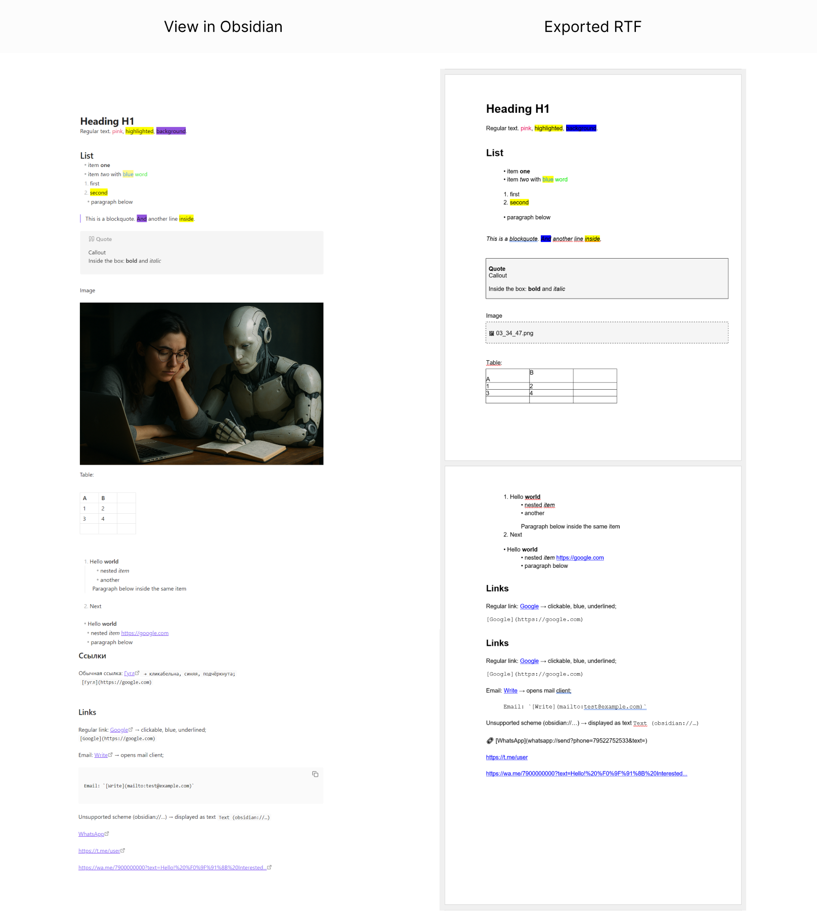

# Export to RTF (Obsidian Plugin)

*[Читать на русском](readme_ru.md)*

## 📖 Description
A plugin for [Obsidian](https://obsidian.md) that allows you to **export notes to RTF** (Rich Text Format).  
Designed with **mobile devices in mind**, but works equally well on desktop.

Main goal — fast and reliable export of notes to a format readable by **Word, LibreOffice, and other editors**.

---

## ✨ Features

* **Markdown support**:
  * Headings H1–H6
  * Paragraphs and blockquotes
  * UL/OL lists with nesting and indentation
  * Tables
  * Callouts → rendered as single-cell note (1×1)

* **Inline styles**:
  * Bold, italic, underline, strikethrough  
  * Code (inline and block)  
  * `<mark>` highlighting (yellow)  
  * Text and background color (from inline styles)

* **Links**:
  * `http(s)://`, `mailto:` → **native RTF hyperlinks** (blue, underlined)  
  * Non-standard schemes (`obsidian://`, `tg://`, `whatsapp://`, etc.) → text: `🔗 [Text](URL)`

* **Images**:
  * `` → boxed placeholder with filename or full path (configurable)

* **UI integration**:
  * Command palette (`Cmd/Ctrl+P`)  
  * Editor context menu  
  * File context menu (right click)  
  * Ribbon icon

---

## ⚙️ Settings
Available under **Settings → Export to RTF**:

* **Show full image path**  
  If disabled — only the filename is shown.  
  If enabled — full path is shown.

---

## ⌨️ Hotkeys
* No hotkeys assigned by default.  
* Can be configured under **Settings → Hotkeys → Download as RTF file**.

---

## 🚀 Installation
1. Download this repository or release package.  
2. Copy the plugin folder into:  
   * Windows: `%APPDATA%\Obsidian\plugins\`  
   * macOS: `~/Library/Application Support/Obsidian/plugins/`  
   * Linux: `~/.config/Obsidian/plugins/`  
3. Restart Obsidian.  
4. Enable the plugin under `Settings → Community Plugins`.

---

## 📌 Usage
* Open the note you want to export.  
* Run the command **Download as RTF file** (via command palette or hotkey).  
* On mobile devices it is also available via **context menu**.  
* The file is saved to your **Downloads** folder, named after the note.

---

## ⚠️ Limitations
* Images are inserted **only as placeholders/paths**, not embedded.  
* Complex CSS styles are not fully supported (basic inline parsing only).  
* Callout blocks share a single unified style.  
* RTF rendering may vary slightly between apps (Google Docs, Word, LibreOffice).

---

## 📷 Screenshots
  
*Note in Obsidian (left) and result in Word (right)*  

---

## 🔄 Compatibility
* **Tested with:**  
  - Word (Windows/macOS)  
  - LibreOffice  
  - Google Docs (RTF import)  

* **Mobile devices:**  
  Works in Obsidian Mobile, but Android/iOS RTF viewers may show minor artifacts (fonts, spacing).

---

## 🗺️ Known issues & roadmap
- No embedded images (placeholders only).  
- No support for table colspan/rowspan.  
- Limited CSS coverage.  
- Planned features:  
  - Export directly to clipboard  
  - Configurable export folder  
  - Additional callout/table styling options  

---

## 📜 Changelog
### v1.0.0 (2025-09-03)
- First release  
- Supported: H1–H6, lists, blockquotes, tables, callouts, inline styles, links, image placeholders  
- Integrated into command palette, context menus, and ribbon  

---

## 📄 License
MIT License  
Author: Ekaterina Larionova, 2025

