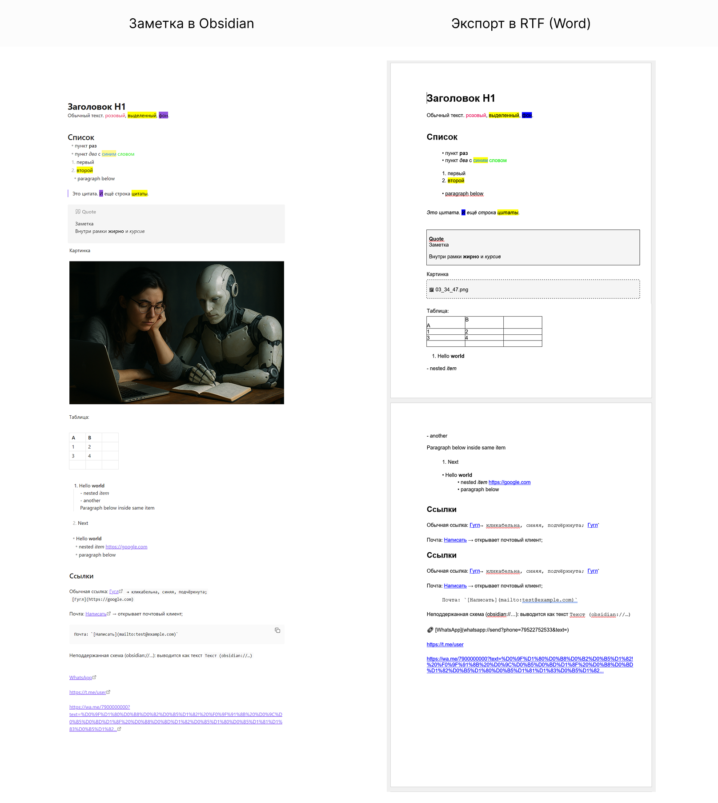

# Export to RTF (Obsidian Plugin)

*[Read in English](./README.md)*

## 📖 Описание
Плагин для [Obsidian](https://obsidian.md), позволяющий **конвертировать заметки в формат RTF** (Rich Text Format).  
Разработан с акцентом на **удобство для мобильных устройств**, но хорошо работает и на десктопах.

Основная цель — быстрый и корректный экспорт заметок в формат, который можно открывать в **Word, LibreOffice и других редакторах**.

---

## ✨ Возможности

* Поддержка **Markdown-разметки**:
  * Заголовки H1–H6
  * Абзацы и цитаты
  * Списки UL/OL с вложенностью и отступами
  * Таблицы
  * Callouts → отдельная ячейка-заметка (1×1)

* **Инлайновые стили**:
  * Жирный, курсив, подчёркивание, зачёркивание  
  * Код (inline и block)  
  * Подсветка `<mark>` (жёлтая)  
  * Цвет текста и фона (из стилей)

* **Ссылки**:
  * `http(s)://`, `mailto:` → **нативные RTF-ссылки** (синие, подчёркнутые)  
  * Нестандартные (`obsidian://`, `tg://`, `whatsapp://` и др.) → текст: `🔗 [Text](URL)`

* **Изображения**:
  * `` → рамочка с именем файла или полным путём (настраивается)

* **UI интеграция**:
  * Команда в палитре (`Cmd/Ctrl+P`)  
  * Контекстное меню редактора  
  * Контекстное меню файлов (правый клик)  
  * Кнопка на ленте (Ribbon icon)

---

## ⚙️ Настройки
В меню **Settings → Export to RTF** доступны опции:

* **Show full image path**  
  Если выключено — показывается только имя файла изображения.  
  Если включено — полный путь.

---

## ⌨️ Горячие клавиши
* По умолчанию горячие клавиши не заданы.  
* Задаются через стандартный интерфейс **Settings → Hotkeys → Download as RTF file**.

---

## 🚀 Установка
1. Скачайте содержимое репозитория или релиза.  
2. Скопируйте папку плагина в:  
   * Windows: `%APPDATA%\Obsidian\plugins\`  
   * macOS: `~/Library/Application Support/Obsidian/plugins/`  
   * Linux: `~/.config/Obsidian/plugins/`  
3. Перезапустите Obsidian.  
4. Включите плагин в `Settings → Community Plugins`.

---

## 📌 Использование
* Откройте нужную заметку.  
* Запустите команду **Download as RTF file** (через палитру команд или горячие клавиши).  
* На мобильных устройствах доступно также через **контекстное меню**.  
* Файл сохраняется в папку загрузок (`Downloads`) с именем заметки.

---

## ⚠️ Ограничения
* Изображения вставляются **только как подписи/пути**, не как встроенные файлы.  
* Не все сложные CSS-стили поддерживаются (используется базовый парсинг inline-стилей).  
* Цвета callout-блоков унифицированы (один стиль для всех).  
* Поведение вставки RTF может отличаться в зависимости от системы (Google Docs, Word, LibreOffice).

---

## 📷 Скриншоты
  
*Заметка в Obsidian (слева) и результат в Word (справа)* 

---

## 🔄 Совместимость
* **Проверено:**  
  - Word (Windows/macOS)  
  - LibreOffice  
  - Google Docs (импорт RTF)  

* **Мобильные устройства:**  
  Работает в Obsidian Mobile, но в Android/iOS RTF-viewer возможны небольшие артефакты (шрифты, отступы).

---

## 🗺️ Известные ограничения и планы
- Нет встроенных картинок (только подписи).  
- Colspan/rowspan в таблицах не поддерживаются.  
- Поддержка нестандартных CSS ограничена.  
- В планах:  
  - Экспорт напрямую в буфер обмена  
  - Выбор папки для сохранения  
  - Дополнительные настройки callout-блоков и таблиц  

---

## 📜 Changelog
### v1.0.0 (2025-09-03)
- Первый релиз  
- Поддержка: H1–H6, списки, цитаты, таблицы, callouts, inline-стили, ссылки, картинки-плейсхолдеры  
- Интеграция в контекстные меню и командную палитру  

---

## 📄 Лицензия
MIT License  
Автор: Ekaterina Larionova, 2025
